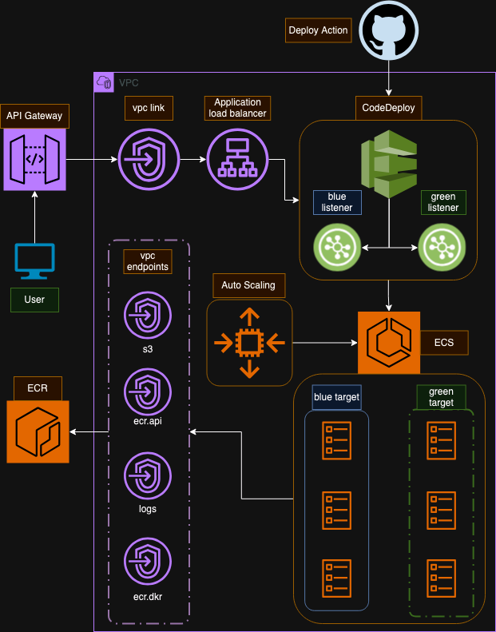

# fargate-auto-scaled-backend

A load balanced and auto-scaled api running on AWS ECS.



## ci

`Init` workflow - manual trigger

1. **ecs-check** Query AWS for existing of service `[obtain current task arn]`.
2. **ecr** Apply ECR and vpc endpoints.
3. **build/image** `[if service doesn't exist]` Push a new *initial* image to ecr.
4. **build/task** `[if service doesn't exist]` Create a new task definition is created.
5. **setup/service** Apply ecs service, load balancer, deploy and auto-scaling.
6. **setup/network** Apply vpc link and api gateway ingress.

`Deploy` workflow - push on `main` trigger

1. **code/image** Build image if changes to `Dockerfile`, `package.json` `src/*` detected.
2. **code/task** Apply task definition (no changes if the same image).
3. **check** Create a `deploy` boolean based on a new task definition (difference to current) detected.
4. **deploy** `[if deploy=true]` Codedeploy deployment is created and status is monitored.

`Destroy` workflow - manual trigger

1. **service** Destroy ecs service, load balancer, deploy and auto-scaling resources.
2. **network** Destroy vpc link and api gateway ingress resources.
3. **task** Destroy task definition.
4. **ecr** Destroy ecr and images.

## usage

- obtain `url` from terraform outputs
- `curl [url]/dev/host`
  - example response below
  
```sh
{
    "message":"Request handled by backend at 2024-09-25T12:28:17.593Z",
    "imageUri":"700011111111.dkr.ecr.eu-west-2.amazonaws.com/fargate-auto-scaled-backend@sha256:78dfc01946306dd6afea2b47b56e196788501bfa93c1b2ee1e90a54e72b56938",
    "hostname":"ip-10-55-161-195.eu-west-2.compute.internal"
}
```

## cpu autoscaling

ECS will auto-scale when CPU reaching upper and lower limits. CPU is for entire ECS service.

Simulate a load on the ECS service with `curl [url]/dev/stress-cpu/50/10`. This example will run 50% CPU load for 10 seconds on .

This will trigger a cloudwatch alarm which will in turn trigger the auto-scaling rule(s).

### setup 

In `tf/service` the below variables are to be considered.

- `cpu_scale_up_threshold`: percentage CPU load to trigger a scale up of tasks.

- `cpu_scale_down_threshold`: percentage CPU load to trigger a scale down of tasks.

- `max_scaled_task_count`: maximum amount of tasks to be allowed.

## docker

```sh
docker build -t express-app .
docker run -i -e BASE_PATH=dev -p 3000:3000 express-app
```

## terraform

Required deployment iam privileges.

```json
[
    "dynamodb:*", 
    "s3:*", 
    "ecr:*", 
    "iam:*", 
    "ecs:*",
    "ec2:*", 
    "elasticloadbalancing:*",
    "application-autoscaling:*",
    "logs:*",
    "cloudwatch:*",
    "apigateway:*",
    "codedeploy:*"
]
```

## ci config

Required github action variables.
- `AWS_ACCOUNT_ID`
- `AWS_REGION`
- `AWS_ROLE` role with above deployment privileges
